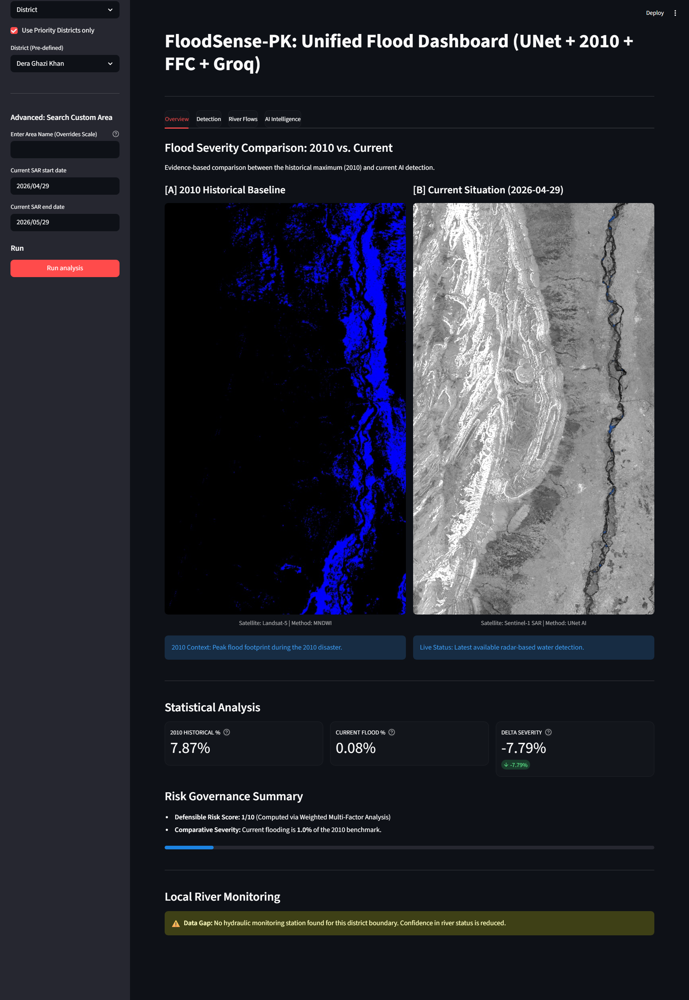
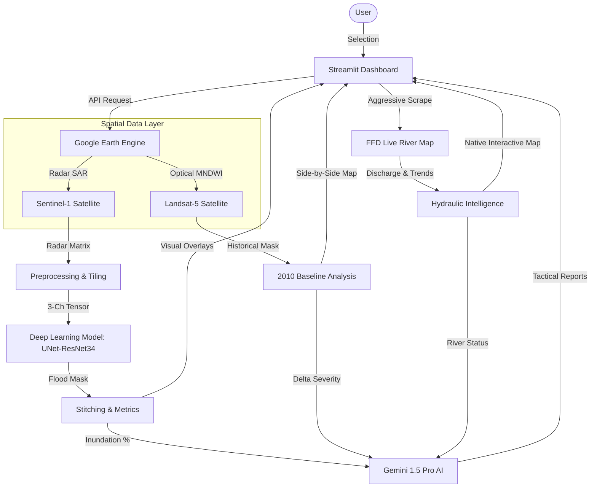
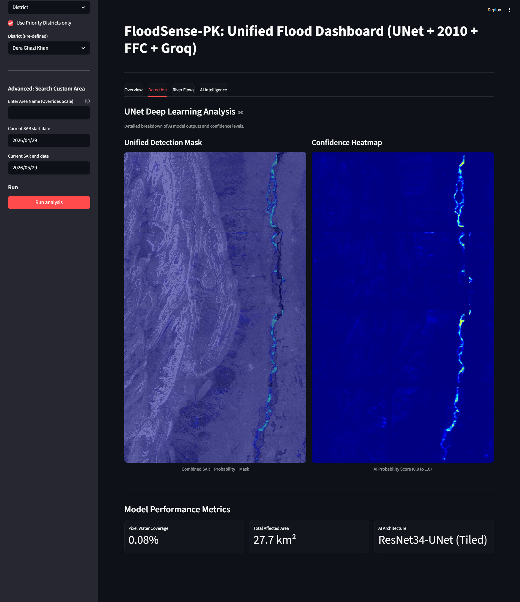
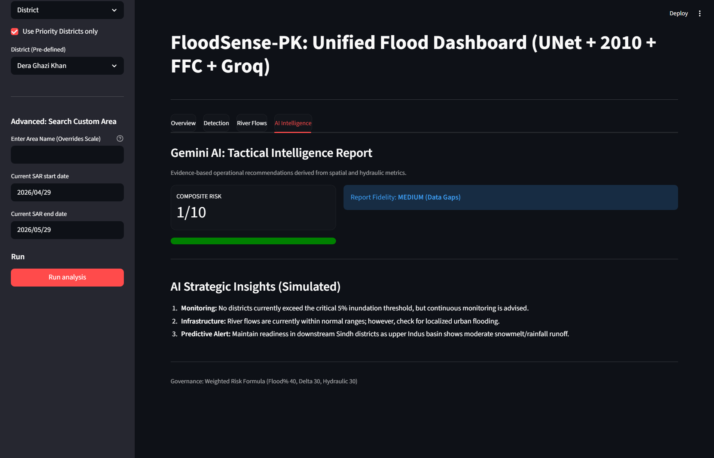

<div align="center">

# 🌊 FloodSense-PK
### National Flood Intelligence & Early Warning System for Pakistan

[](https://earthengine.google.com/)
[](https://deepmind.google/technologies/gemini/)
[](https://streamlit.io/)
[](https://pytorch.org/)

<br/>

> **High-fidelity flood monitoring combining Satellite Radar AI, Historical Benchmarks, and Real-time Hydraulic Data.**
> Developed for disaster management authorities to enable data-driven response and recovery.

<br/>



</div>

---

## 📋 Table of Contents
- [System Architecture](#-system-architecture)
- [Satellite Intelligence](#-satellite-intelligence)
- [Deep Learning Model](#-deep-learning-model)
- [Historical Benchmarking (2010)](#-historical-benchmarking-2010)
- [Hydraulic Command Center](#-hydraulic-command-center)
- [Strategic AI Insights](#-strategic-ai-insights)
- [Installation & Setup](#-installation--setup)
- [Tech Stack](#-tech-stack)

---

## 🏗️ System Architecture

The system follows a multi-layered data fusion approach, combining spatial and tabular data sources processed via Google Earth Engine and high-performance AI models.



---

## 🛰️ Satellite Intelligence

### [A] Sentinel-1 SAR (The "Now")
Unlike optical cameras, Sentinel-1's **C-band Synthetic Aperture Radar** can see through monsoon clouds, rain, and smoke. It operates by bouncing radar pulses off the Earth and measuring the backscatter.
*   **Resolution:** 10 meters/pixel.
*   **Detection Physics:** Water acts as a "Specular Reflector" (mirror), bouncing signals away and appearing **pitch black** in the imagery.

<div align="center">
    
    
    <p><i>Left: Raw SAR Radar | Right: AI Detected Flood Mask (Blue)</i></p>
</div>

### [B] Landsat-5 (The "Then" - 2010 Baseline)
Used to reconstruct the **2010 Great Pakistan Floods**. We use the **MNDWI (Modified Normalized Difference Water Index)** to isolate water signatures from optical/thermal bands.
*   **Formula:** `(Green - SWIR) / (Green + SWIR)`
*   **Baseline Filter:** We subtract the **2009 permanent water map** to ensure we only show "New" flooded areas on the dashboard.

---

## 🧠 Deep Learning Model

The core engine is a **UNet-ResNet34 Architecture** trained on the **Sen1Floods11** global benchmark dataset.

### Technical Specifications:
- **Architecture:** U-Net (encoder="resnet34", encoder_weights="imagenet")
- **Input:** 3-Channel Tensor (Normalized VV, VH approximation, VH/VV ratio)
- **Tiling:** Supports **Dynamic Resolution Tiled Inference** (slices 1024px maps into 256px chunks).
- **Metric:** Validation IoU of **0.5503** (Strong performance on turbid flood signatures).

```python
# Inference Flow
SAR Image → Normalization → 256px Tiling → ResNet34 Encoder → Skip Connections → Decoder → Sigmoid → 0.5 Threshold → Binary Flood Mask
```

---

## 📜 Historical Benchmarking (2010)

FloodSense-PK provides a unique **Side-by-Side Comparison** feature. It aligns 2010 historical Landsat data with today's Sentinel-1 radar detection to calculate **Delta Severity**.



- **Positive Delta (+):** Current flood extent exceeds the 2010 disaster (CRITICAL).
- **Negative Delta (-):** Situation is safer than the 2010 benchmark.

---

## 🌊 Hydraulic Command Center

A native, interactive map and real-time chart system tracking the status of every major barrage and dam in Pakistan.

### Features:
- **Native Topology Map:** Visualizes the flow links between stations (Tarbela → Sukkur → Kotri).
- **Live Status:** Color-coded markers (Green: Normal, Red: Extreme).
- **Trend Detection:** Tracks if river levels are **Rising**, **Falling**, or **Steady**.
- **Official FFD Source:** Aggressive regex parsing of official government JavaScript objects for sub-second data accuracy.

<div align="center">
    
    <p><i>Pakistan River Network Visualizer</i></p>
</div>

---

## 🔮 Strategic AI Insights

Powered by **Gemini 1.5 Pro**, the system generates numerically grounded, operational reports.



- **[SITUATION SUMMARY]:** Evidence-based overview of inundation.
- **[HYDRAULIC ANALYSIS]:** Links barrage inflow (Cusecs) to ground flooding.
- **[OPERATIONAL ACTIONS]:** Specific data-backed instructions for relief agencies.
- **Defensible Risk Score:** A 1-10 weighted formula combining Inundation (40%), 2010 Delta (30%), and River Status (30%).

---

## 🛠️ Tech Stack

### Google Technologies (Primary Engine)
- **Google Earth Engine (GEE):** Massive-scale satellite data processing.
- **Gemini 1.5 Pro/Flash:** Strategic tactical report generation and risk analysis.
- **USGS/NASA Landsat Program:** Historical archival data.

### Development Stack
- **Python 3.10+:** Core system logic.
- **PyTorch:** UNet model inference.
- **Streamlit:** Executive dashboard framework.
- **Pydeck:** Native high-performance map rendering.
- **Rasterio & GDAL:** Geographic data handling.

---

## 🚀 Installation & Setup

```bash
# 1. Clone & Environment
git clone https://github.com/your-repo/FloodSense-PK.git
python -m venv .venv
source .venv/bin/activate

# 2. Dependencies
pip install -r requirements.txt

# 3. Authentication
earthengine authenticate

# 4. Launch
streamlit run streamlit_app.py
```

---
<div align="center">
Developed as a high-fidelity intelligence platform for the 2026 GDG Flood Forecast Challenge.
</div>
