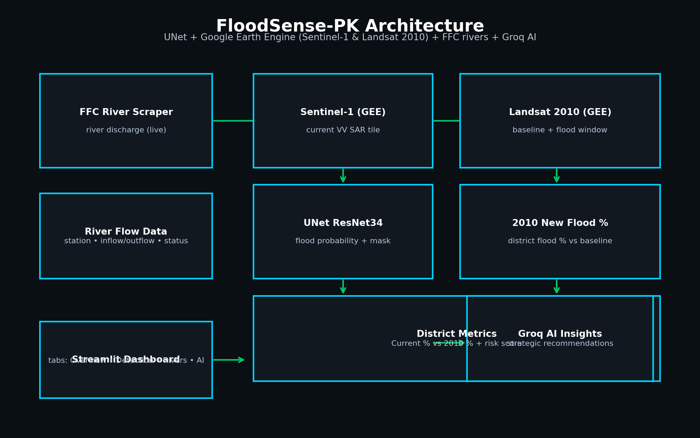
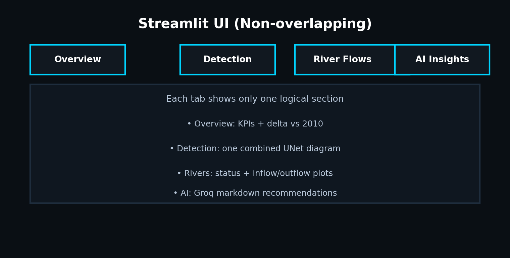

# FloodSense-PK
AI-powered flood early warning dashboard for Pakistan



## What it does
FloodSense estimates **district-level flood risk** by combining:
- **Live Sentinel-1 SAR (GEE)** + **UNet ResNet34** → current flood % and mask
- **Historical 2010 flood baseline (GEE Landsat)** → 2010 new flood % for comparison
- **FFC river discharge scraper** → inflow/outflow + NORMAL/HIGH/EXTREME status
- **Groq AI** → strategic recommendations (fallback to simulated insights if keys are missing)

The main user interface is **Streamlit** (single non-overlapping dashboard).



## Key outputs (in the Streamlit app)
- KPIs: Current flood %, 2010 new flood %, Δ vs 2010, risk score (1–10)
- One clear UNet diagram (SAR + probability + flood mask)
- Flood probability heatmap
- River-flow visualizations (status distribution, top inflow/outflow, inflow vs outflow scatter)
- Groq AI strategic insights

## Setup
### 1) Create your virtual environment
```powershell
python -m venv .venv
.\.venv\Scripts\activate
```

### 2) Install dependencies
```powershell
pip install earthengine-api torch torchvision timm rasterio segmentation-models-pytorch albumentations Pillow matplotlib numpy requests python-dotenv streamlit geopandas shapely beautifulsoup4
```

### 3) Configure environment variables (`.env`)
Create a file `.env` in the repo root:
```env
PROJECT_ID=your-google-cloud-project-id
GROQ_API_KEY=gsk_...
Data_URL=https://...  # FFC discharge page URL
# Optional:
GEMINI_API_KEY=your-gemini-api-key
```

### 4) Authenticate Google Earth Engine
```powershell
earthengine authenticate
```

## Run (recommended: Streamlit)
```powershell
streamlit run streamlit_app.py
```

Usage in the app:
1. Choose a **District**
2. Choose **Current SAR start date** and **Current SAR end date**
3. Click **Run analysis**
4. Review tabs: **Overview**, **Detection**, **River Flows**, **AI Insights**

## Optional: Run batch pipeline (generates a PNG only)
```powershell
python main.py --quick --skip-historical
```

You can also set a custom SAR window:
```powershell
python main.py --skip-historical --current-start 2024-01-01 --current-end 2024-01-31
```

Batch run writes:
- `outputs/flood_map.png`
- `data/json/river_flows.json`
- `data/json/ai_insights.json`

## Project structure
- `streamlit_app.py` : main UI (single dashboard)
- `main.py` : optional batch pipeline
- `models/model_inference.py` : UNet preprocessing + prediction
- `engine/ai_alerts.py` : Groq AI insight generation + fallback
- `scrapers/ffc_scraper.py` : FFC river discharge scraping
- `utils/ndwi.py` : GEE Landsat NDWI (2010 historical mask)
- `utils/districts.py` : district name detection + flood % calculation

## Notes / performance
- Computing the **2010 Landsat mask** can take a while. In Streamlit, it’s cached in your session (so it won’t repeat every click).
- UNet inference runs after the SAR thumbnail is fetched from GEE.

## License
Add your license here.


---
Sentinel-1 Satellite
        ↓
Google Earth Engine
        ↓
VV SAR band
        ↓
Median composite
        ↓
PNG rendering
        ↓
requests.get()
        ↓
PIL image preprocessing
        ↓
UNet model