<p align="center">

# FloodSense-PK

### National Flood Intelligence & Early Warning System for Pakistan


</p>

<p align="center">
  <strong>High-fidelity flood monitoring combining Satellite Radar AI, Historical Benchmarks, and Real-time Hydraulic Data.</strong><br/>
  Built for disaster management authorities — data-driven response when monsoon clouds block optical satellites.
</p>

```
SAR Satellite Image  →  U-Net ResNet34  →  Flood Probability Map  →  Weighted Risk Score
     (Sentinel-1)         (~24M params)      (pixel-level)              (1–10)
        +
Landsat-5 MNDWI (2010)  →  Delta vs Benchmark  →  Gemini / Groq Tactical Report
```

<p align="center">
  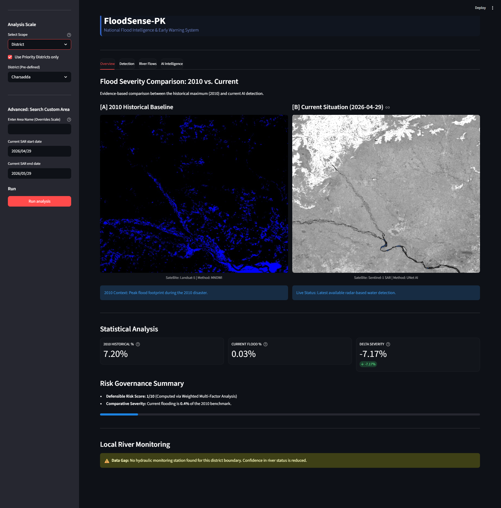
</p>

<p align="center"><em>FloodSense-PK Streamlit executive dashboard — District, Province, and National analysis</em></p>

---

## * Table of Contents

- [Overview](#overview)
- [Why This Matters](#why-this-matters)
- [System Architecture](#system-architecture)
- [Executive Dashboard](#executive-dashboard)
- [Satellite Intelligence](#satellite-intelligence)
- [Deep Learning Engine](#deep-learning-engine)
- [Results and Visual Outputs](#results-and-visual-outputs)
- [Historical Benchmarking (2010)](#historical-benchmarking-2010)
- [Hydraulic Command Center](#hydraulic-command-center)
- [Strategic AI Insights](#strategic-ai-insights)
- [Risk Scoring](#risk-scoring)
- [Project Structure](#project-structure)
- [Installation](#installation)
- [Usage](#usage)
- [Limitations](#limitations)
- [Tech Stack](#tech-stack)
- [References](#references)

---

## * Overview

**FloodSense-PK** is an end-to-end flood intelligence platform for Pakistan. It fuses three independent evidence streams:

| Layer | Source | What it answers |
|-------|--------|-----------------|
| **Now** | Sentinel-1 SAR + U-Net ResNet34 | Where is water *right now*, through clouds and at night? |
| **Then** | Landsat-5 MNDWI (2010 baseline) | How does today compare to the **2010 Great Pakistan Floods**? |
| **Live** | FFD river discharge scraper | Are upstream barrages in NORMAL, HIGH, or EXTREME status? |

The **Streamlit dashboard** (`streamlit_app.py`) is the primary interface. A CLI pipeline (`main.py`) runs the same engine headlessly for batch district analysis.

### Key capabilities

- **Multi-scale analysis** — District, Province, or National scope with dynamic GEE resolution (≈80 m district / ≈1000 m overview).
- **Tiled U-Net inference** — Large SAR tiles (up to 1024×1024) sliced into 256×256 patches with stitched flood masks.
- **2010 vs Current comparison** — Side-by-side historical and live flood % with **Delta Severity**.
- **Native river map** — Pydeck topology linking Tarbela → Sukkur → Kotri and tributary networks.
- **AI tactical reports** — Gemini 1.5 Flash (primary) or Groq (fallback) generate structured operational briefings.

### Model benchmark (Sen1Floods11)

| Metric | Value |
|--------|-------|
| Best Validation IoU | **0.5503** |
| Best Epoch | 18 / 60 |
| Architecture | U-Net + ResNet34 (ImageNet encoder) |
| Input channels | 3 (SAR VV, SAR VH, VH/VV ratio) |
| Parameters | ~24 million |
| Training dataset | Sen1Floods11 (11 global flood events) |

---

## * Why This Matters

```
┌─────────────────────────────────────────────────────────┐
│  5–8 million people affected by floods annually (PK)    │
│  $3–4 billion annual economic losses                    │
│  33 million displaced in the 2022 Pakistan floods       │
│  < 6 hours warning for many rural communities           │
└─────────────────────────────────────────────────────────┘
```

Traditional flood mapping fails during active monsoon events: field surveys are slow and dangerous, and **optical satellites cannot see through cloud cover**. FloodSense-PK uses **C-band SAR** that penetrates clouds and works 24/7, then grounds predictions in **2010 historical severity** and **live barrage discharge** from Pakistan's Flood Forecasting Division (FFD).

---

## * System Architecture

> **Diagrams:** Mermaid blocks render on **GitHub.com**. Cursor/VS Code preview may show raw code only — use the PNG fallback under the sequence diagram, or push to GitHub to verify.  
> **Images:** Screenshots and figures live under `public/` (including `public/dashboard/`). Paths are repo-relative, e.g. `public/dashboard/...`.

### UML component diagram (high-level data flow)

Vertical component layout: presentation → spatial/AI/hydraulic services → intelligence → outputs.

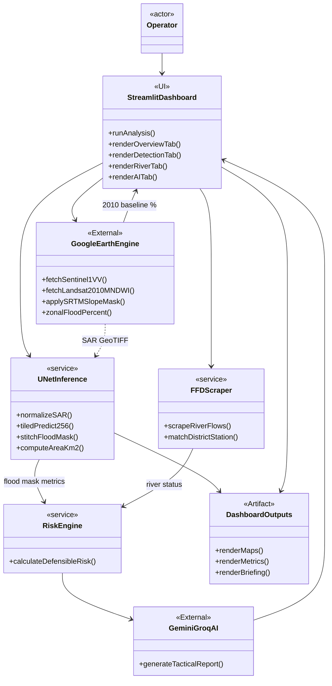
```mermaid
classDiagram
    direction TB

  class Operator {
    <<actor>>
  }

  class StreamlitDashboard {
    <<UI>>
    +runAnalysis()
    +renderOverviewTab()
    +renderDetectionTab()
    +renderRiverTab()
    +renderAITab()
  }

  class GoogleEarthEngine {
    <<External>>
    +fetchSentinel1VV()
    +fetchLandsat2010MNDWI()
    +applySRTMSlopeMask()
    +zonalFloodPercent()
  }

  class UNetInference {
    <<service>>
    +normalizeSAR()
    +tiledPredict256()
    +stitchFloodMask()
    +computeAreaKm2()
  }

  class FFDScraper {
    <<service>>
    +scrapeRiverFlows()
    +matchDistrictStation()
  }

  class RiskEngine {
    <<service>>
    +calculateDefensibleRisk()
  }

  class GeminiGroqAI {
    <<External>>
    +generateTacticalReport()
  }

  class DashboardOutputs {
    <<Artifact>>
    +renderMaps()
    +renderMetrics()
    +renderBriefing()
  }

  Operator --> StreamlitDashboard
  StreamlitDashboard --> GoogleEarthEngine
  StreamlitDashboard --> UNetInference
  StreamlitDashboard --> FFDScraper
  GoogleEarthEngine ..> UNetInference : SAR GeoTIFF
  GoogleEarthEngine --> StreamlitDashboard : 2010 baseline %
  UNetInference --> RiskEngine : flood mask metrics
  FFDScraper --> RiskEngine : river status
  RiskEngine --> GeminiGroqAI
  GeminiGroqAI --> StreamlitDashboard
  UNetInference --> DashboardOutputs
  StreamlitDashboard --> DashboardOutputs
```

### UML sequence diagram (component interaction)

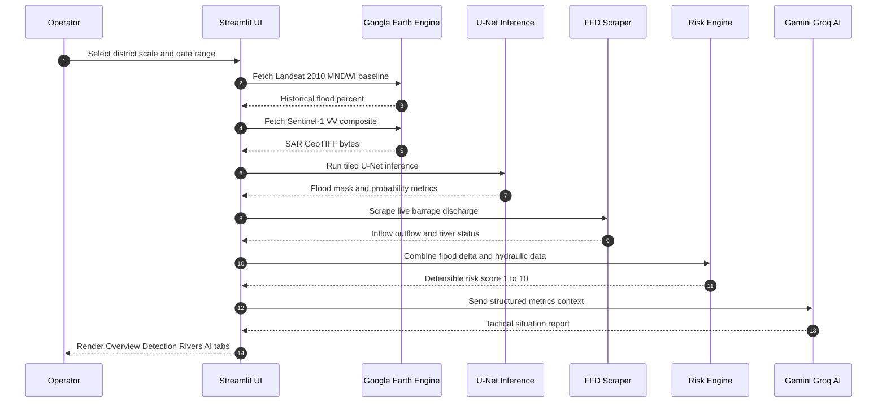
```mermaid
sequenceDiagram
    autonumber
    participant Op as Operator
    participant UI as Streamlit UI
    participant GEE as Google Earth Engine
    participant ML as U-Net Inference
    participant FFD as FFD Scraper
    participant Risk as Risk Engine
    participant AI as Gemini Groq AI

    Op->>UI: Select district scale and date range
    UI->>GEE: Fetch Landsat 2010 MNDWI baseline
    GEE-->>UI: Historical flood percent
    UI->>GEE: Fetch Sentinel-1 VV composite
    GEE-->>UI: SAR GeoTIFF bytes
    UI->>ML: Run tiled U-Net inference
    ML-->>UI: Flood mask and probability metrics
    UI->>FFD: Scrape live barrage discharge
    FFD-->>UI: Inflow outflow and river status
    UI->>Risk: Combine flood delta and hydraulic data
    Risk-->>UI: Defensible risk score 1 to 10
    UI->>AI: Send structured metrics context
    AI-->>UI: Tactical situation report
    UI-->>Op: Render Overview Detection Rivers AI tabs
```

<p align="center">
  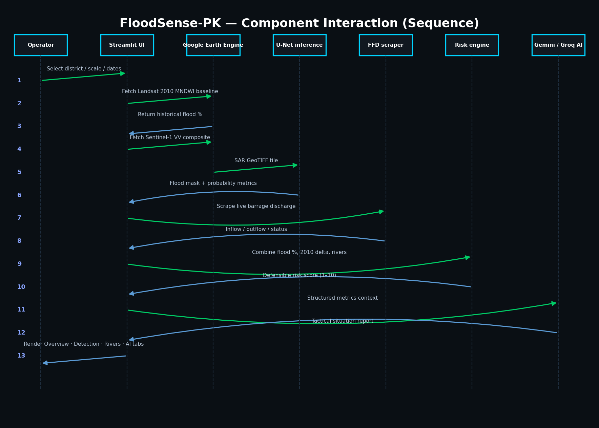
</p>

<p align="center"><em>Static fallback — renders everywhere Mermaid preview is unavailable</em></p>

### UML deployment diagram

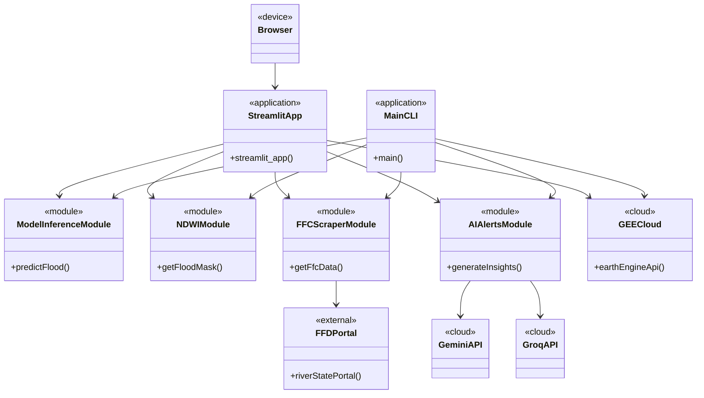
```mermaid
classDiagram
    direction TB

  class Browser {
    <<device>>
  }

  class StreamlitApp {
    <<application>>
    +streamlit_app()
  }

  class MainCLI {
    <<application>>
    +main()
  }

  class ModelInferenceModule {
    <<module>>
    +predictFlood()
  }

  class NDWIModule {
    <<module>>
    +getFloodMask()
  }

  class FFCScraperModule {
    <<module>>
    +getFfcData()
  }

  class AIAlertsModule {
    <<module>>
    +generateInsights()
  }

  class GEECloud {
    <<cloud>>
    +earthEngineApi()
  }

  class FFDPortal {
    <<external>>
    +riverStatePortal()
  }

  class GeminiAPI {
    <<cloud>>
  }

  class GroqAPI {
    <<cloud>>
  }

  Browser --> StreamlitApp
  StreamlitApp --> ModelInferenceModule
  StreamlitApp --> NDWIModule
  StreamlitApp --> FFCScraperModule
  StreamlitApp --> AIAlertsModule
  MainCLI --> ModelInferenceModule
  MainCLI --> NDWIModule
  MainCLI --> FFCScraperModule
  MainCLI --> AIAlertsModule
  StreamlitApp --> GEECloud
  MainCLI --> GEECloud
  FFCScraperModule --> FFDPortal
  AIAlertsModule --> GeminiAPI
  AIAlertsModule --> GroqAPI
```

---

## * Executive Dashboard

The dashboard runs at `http://localhost:8501` with four analytical tabs after **Run analysis**.

| Tab | Purpose |
|-----|---------|
| **Overview** | 2010 vs Current side-by-side, Delta Severity, risk score |
| **Detection** | SAR + probability heatmap + unified mask, km² affected |
| **River Flows** | FFD status map, bar charts, inflow/outflow scatter |
| **AI Intelligence** | Structured Gemini tactical report |

### Overview — 2010 vs Current comparison

<p align="center">
  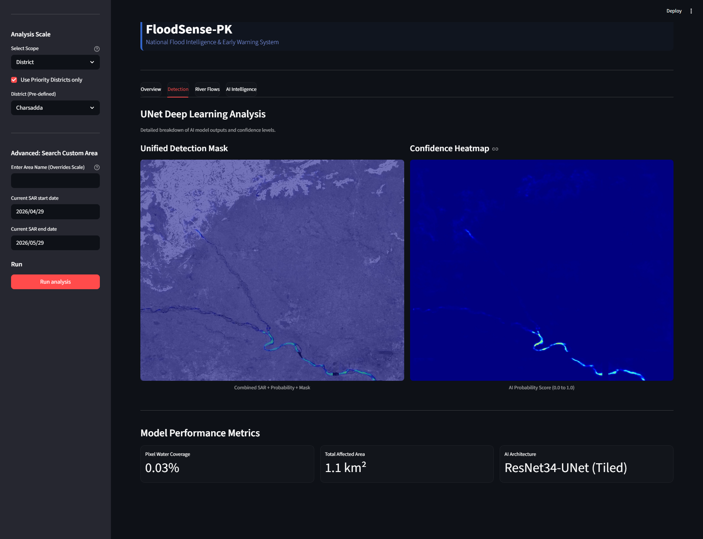
</p>

### Detection — U-Net outputs and confidence

<p align="center">
  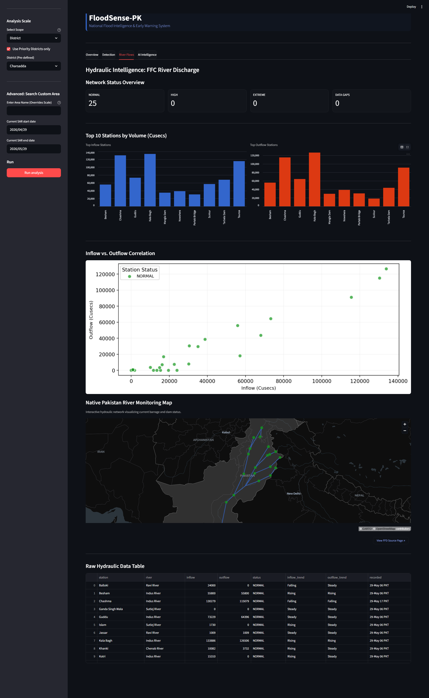
</p>

### River Flows — FFD hydraulic network

<p align="center">
  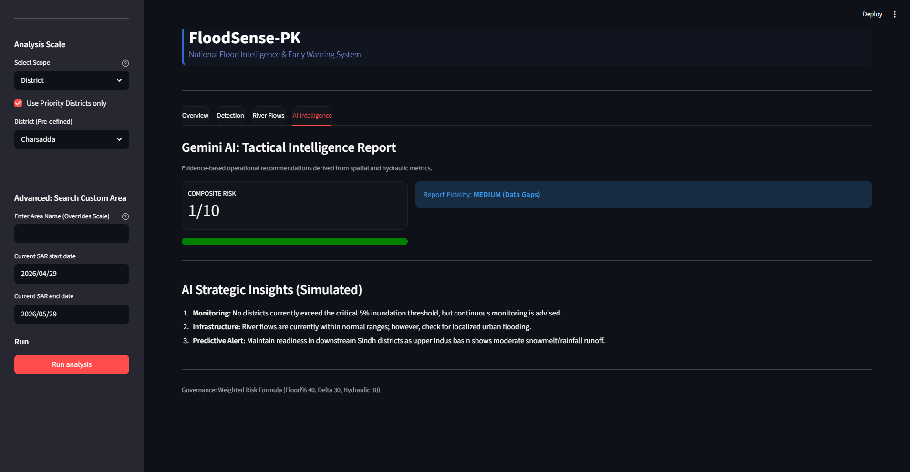
</p>

---

## * Satellite Intelligence

FloodSense-PK uses **two complementary satellites** — one for *now* (radar) and one for *then* (optical historical benchmark).

---

### Sentinel-1 — Synthetic Aperture Radar (The "Now")

<p align="center">
  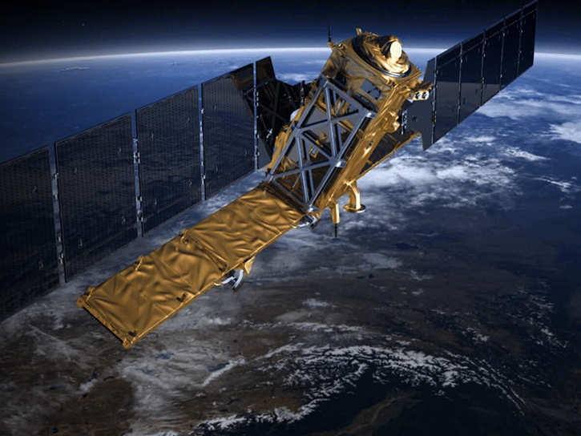
</p>

**Sentinel-1** is a European Space Agency mission carrying **C-band SAR** at 5.4 GHz. Unlike cameras, it actively transmits radar pulses and measures backscatter — so it operates through clouds, rain, smoke, and at night.

| Property | Detail |
|----------|--------|
| **Revisit** | ~6 days (constellation) |
| **Resolution** | 10 m (IW mode) |
| **Polarizations** | VV, VH (this app uses VV from GEE; VH approximated at inference) |
| **Flood physics** | Open water acts as a specular mirror → very weak return → **dark in SAR** |

**Why SAR wins during monsoon:**

| Capability | Optical (Landsat / S2) | SAR (Sentinel-1) |
|------------|------------------------|------------------|
| Through clouds | No — blocked | Yes — penetrates |
| Night operation | No — needs sunlight | Yes — active sensor |
| Peak flood capture | No — often blind | Yes — reliable |

**In this project:** GEE fetches `COPERNICUS/S1_GRD` VV median over the selected date window, applies an **SRTM slope mask** (&lt; 15°) to reduce terrain false positives, then feeds the tile to U-Net.

| Raw SAR (Charsadda) | AI Flood Mask |
|:---:|:---:|
| 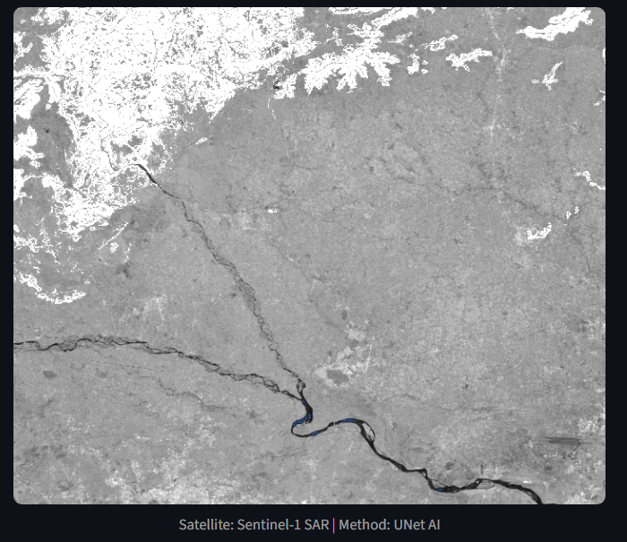 | 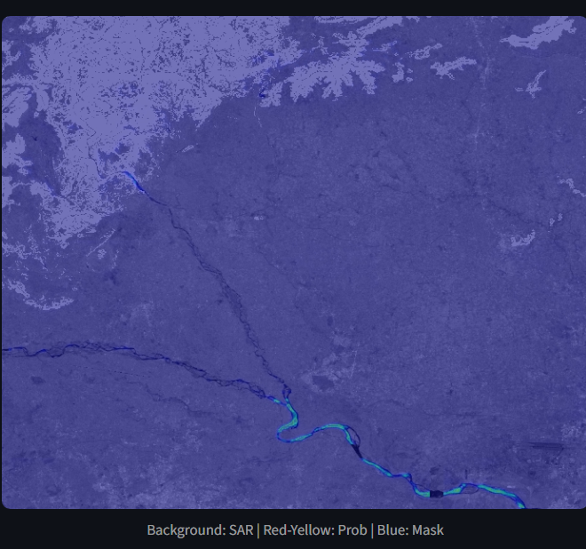 |

<p align="center"><em>District-level Sentinel-1 backscatter and U-Net flood overlay</em></p>

| Province-scale SAR | Province flood heatmap |
|:---:|:---:|
| 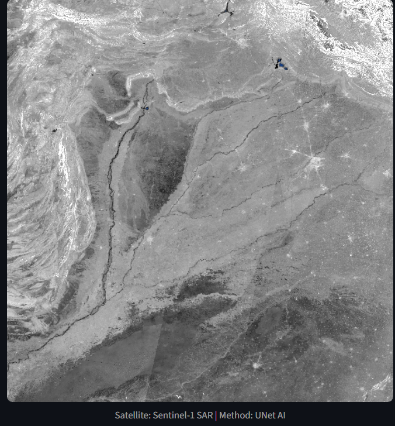 | 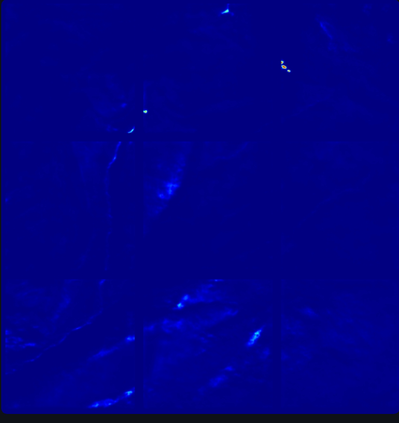 |

---

### Landsat-5 — Optical Historical Baseline (The "Then")

<p align="center">
  
</p>

**Landsat-5** (NASA/USGS) provides multispectral optical imagery used here to reconstruct the **2010 Great Pakistan Floods** — the worst flood disaster in the country's modern history.

| Property | Detail |
|----------|--------|
| **Era used** | July–September 2010 (peak flood window) |
| **Baseline** | 2009 permanent water subtracted |
| **Method** | **MNDWI** — Modified Normalized Difference Water Index |
| **Formula** | `(Green − SWIR1) / (Green + SWIR1)` |
| **Bands** | Landsat 5 TM C2 L2 — Green `SR_B2`, SWIR1 `SR_B5` |
| **Threshold** | MNDWI &gt; −0.1 (sensitive to turbid floodwater) |

**Pipeline logic:** Compute 2010 flood water mask → subtract 2009 baseline water → district flood % via GEE zonal stats → compare to current SAR detection for **Delta Severity**.

| District — 2010 flood footprint | Province — Landsat baseline |
|:---:|:---:|
| 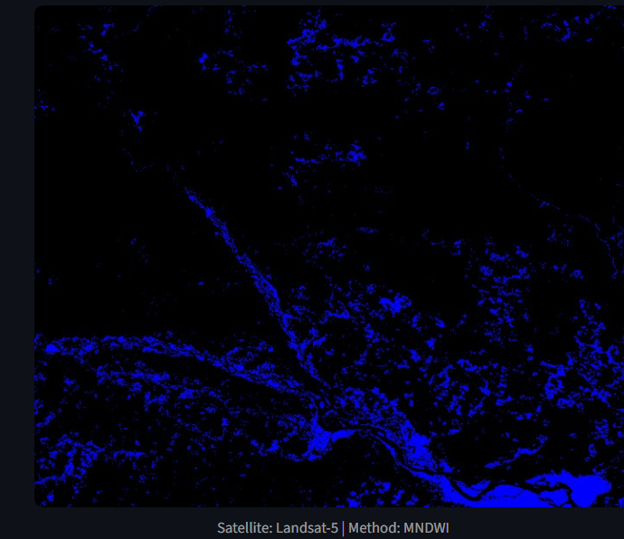 | 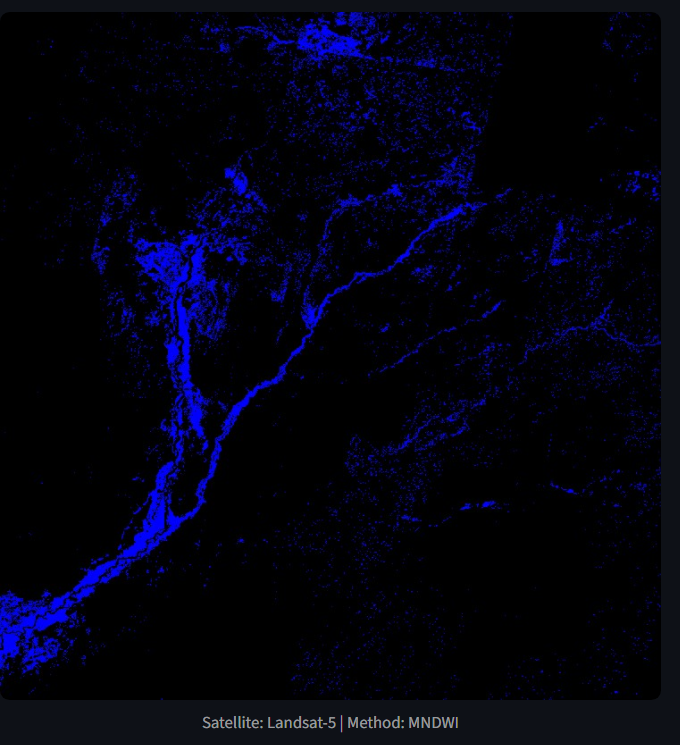 |

| Province water mask | Reference river network |
|:---:|:---:|
| 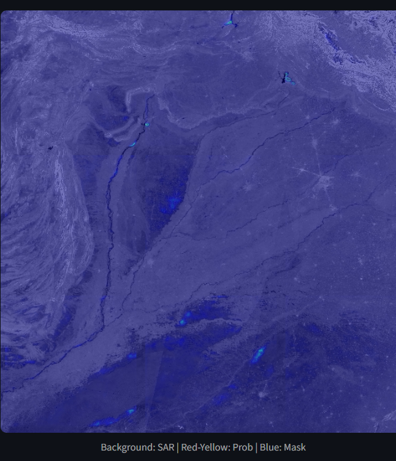 | 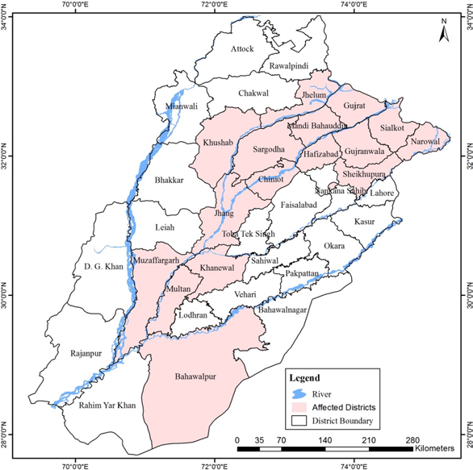 |

---

## * Deep Learning Engine

The segmentation backbone is a **U-Net with ResNet34 encoder**, trained on the global **Sen1Floods11** benchmark and integrated into this platform via tiled GEE export inference.

### Pipeline

```
GEE Sentinel-1 VV GeoTIFF
        │
        ▼
Normalize: VV [-40,10]dB │ VH approx (VV−6dB) │ VH/VV linear ratio
        │
        ▼
Slice into 256×256 tiles (supports up to 1024×1024 exports)
        │
        ▼
U-Net ResNet34 → Sigmoid → threshold 0.5
        │
        ▼
Stitch tiles + 8px border zeroing → flood mask + probability map
        │
        ▼
Coverage % · affected km² · risk score
```

### Architecture (U-Net + ResNet34)

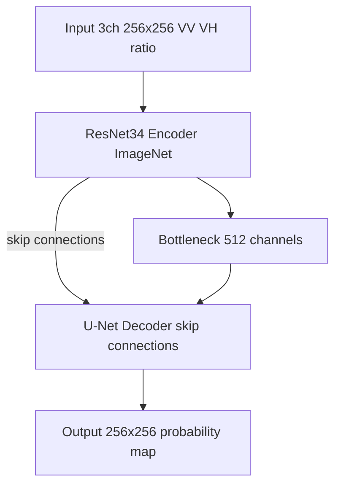
```mermaid
flowchart TB
    IN["Input 3ch 256x256 VV VH ratio"]
    ENC["ResNet34 Encoder ImageNet"]
    BOT["Bottleneck 512 channels"]
    DEC["U-Net Decoder skip connections"]
    OUT["Output 256x256 probability map"]

    IN --> ENC
    ENC -->|skip connections| DEC
    ENC --> BOT --> DEC --> OUT
```

### Training highlights (model repo)

| Setting | Value |
|---------|-------|
| Loss | Dice + Focal (γ=2) |
| Optimizer | AdamW, lr=5e−5 |
| Scheduler | ReduceLROnPlateau (patience=5) |
| Patch size | 256×256, 50% overlap |
| Augmentation | SAR-safe geometry only (flip, rotate, affine) |

**Why only 3 SAR channels from Sen1Floods11's 8?** Optical and precipitation channels fail during cloud-covered floods. Three-channel SAR enables ImageNet transfer learning and encodes the core flood backscatter physics.

### IoU 0.5503 — what it means

```
IoU = |Prediction ∩ Ground Truth| / |Prediction ∪ Ground Truth|
```

A score of **0.55** on Sen1Floods11 is a solid single-model result without ensembling — honest performance on a globally diverse, peer-reviewed benchmark.

| Approach | Typical IoU (Sen1Floods11) |
|----------|----------------------------|
| dB threshold only | ~0.30 |
| U-Net no pretrain | 0.40–0.50 |
| **This model (U-Net ResNet34)** | **0.5503** |
| Attention U-Net | 0.52–0.62 |
| Published ensembles | up to ~0.78 |

> Place trained weights at `models/best_flood_model.pth` (not committed — large binary).

---

## * Results and Visual Outputs

### District level — Charsadda case study

End-to-end outputs for a priority flood-prone district: SAR input, AI mask, probability heatmap, 2010 baseline, and matched FFD station context.

| Sentinel-1 SAR input | U-Net flood mask |
|:---:|:---:|
|  |  |

| AI probability heatmap | 2010 Landsat-5 baseline |
|:---:|:---:|
| 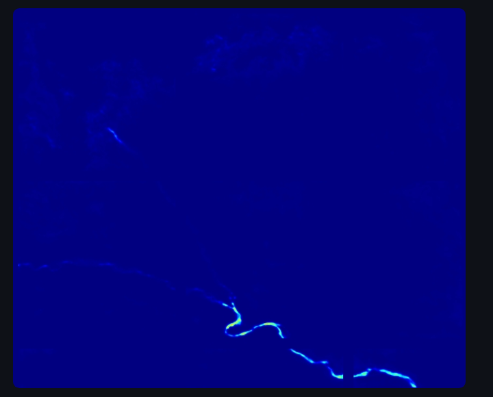 |  |

| Live FFD river status (matched station) |
|:---:|
| 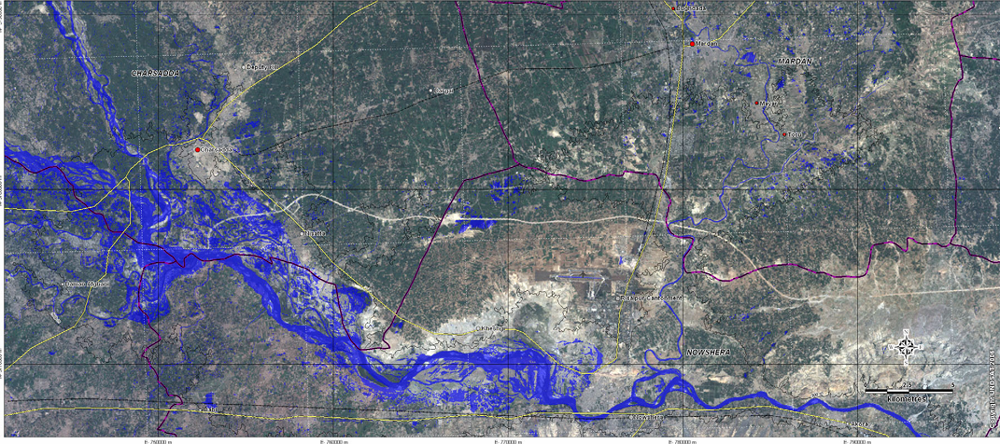 |

### Province level — Punjab overview

Low-resolution provincial scans (~1000 m) for rapid situational awareness across large areas.

| Sentinel-1 province scan | Landsat-5 2010 province baseline |
|:---:|:---:|
|  |  |

| Provincial flood heatmap | MNDWI water mask |
|:---:|:---:|
|  |  |

---

## * Historical Benchmarking (2010)

The **Overview** tab aligns 2010 Landsat MNDWI with current Sentinel-1 / U-Net detection:

| Metric | Meaning |
|--------|---------|
| **2010 Historical %** | District area flooded during 2010 peak (GEE zonal) |
| **Current Flood %** | Live SAR + U-Net detection |
| **Delta Severity** | Current % − 2010 % |

**Interpretation:**

- **Positive delta (+)** → Current flooding **exceeds** the 2010 disaster footprint → **CRITICAL**
- **Negative delta (−)** → Situation **safer** than the 2010 benchmark

Comparative severity is also expressed as a ratio: `current / 2010 × 100%`.

---

## * Hydraulic Command Center

Real-time river intelligence scraped from Pakistan's official **FFD** (Flood Forecasting Division) portal.

### Features

- **20+ monitoring stations** — Tarbela, Sukkur, Kotri, Taunsa, Guddu, and tributary links
- **Status classification** — NORMAL · HIGH · EXTREME · NOT_RECEIVED
- **Trend detection** — Inflow / outflow Rising · Falling · Steady
- **Native Pydeck map** — Color-coded stations + upstream→downstream path layers
- **Analytics** — Top-10 bar charts, inflow vs outflow scatter by status

<p align="center">
  
</p>

<p align="center"><em>Indus main stem and tributary barrage network visualized in the River Flows tab</em></p>

**River topology encoded in app:**

```
Tarbela → Besham → Kala Bagh → Chashma → Taunsa → Guddu → Sukkur → Kotri
Nowshera → Kala Bagh          (Kabul)
Mangla → Trimmu               (Jhelum)
Marala → Khanki → Qadirabad → Trimmu → Punjnad → Guddu
```

---

## * Strategic AI Insights

Powered by **Gemini 1.5 Flash** (primary) with **Groq** fallback. Reports are numerically grounded — the model receives flood %, 2010 delta, risk score, and matched station hydraulic data.

**Structured output sections:**

| Section | Content |
|---------|---------|
| `[SITUATION SUMMARY]` | Evidence-based inundation overview |
| `[HYDRAULIC ANALYSIS]` | Links barrage cusecs to ground flooding |
| `[HISTORICAL BENCHMARK]` | 2010 comparison narrative |
| `[OPERATIONAL ACTIONS]` | Data-backed instructions for relief agencies |
| `[CONFIDENCE]` | Report fidelity given data gaps |

If no API keys are configured, the engine returns a deterministic simulated briefing.

---

## * Risk Scoring

**Defensible composite risk (1–10)** — transparent weighted formula in `engine/ai_alerts.py`:

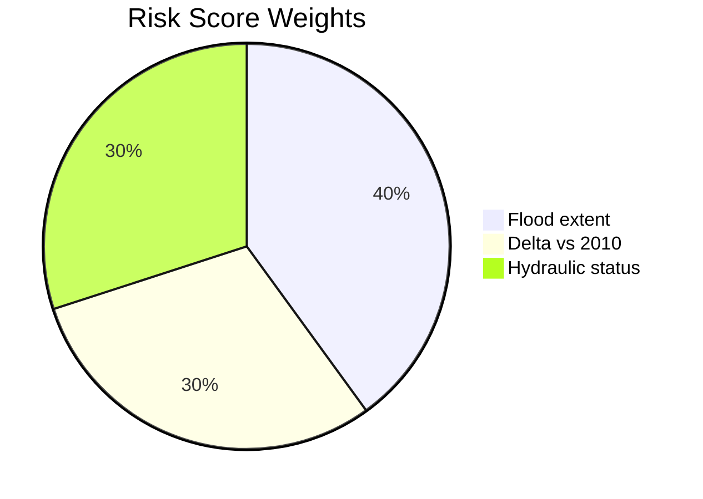
```mermaid
pie title Risk Score Weights
    "Flood extent" : 40
    "Delta vs 2010" : 30
    "Hydraulic status" : 30
```

| Factor | Weight | Logic |
|--------|--------|-------|
| Flood extent | 40% | Scales with current inundation % |
| Delta vs 2010 | 30% | Spikes when today exceeds 2010 benchmark |
| River status | 30% | EXTREME=10, HIGH=7, NORMAL=2 |

Simple pixel risk from U-Net alone: `min(10, max(1, round(flood_pct / 10)))`.

---

## * Project Structure

```
GDG-Flood-forcast/
│
├── streamlit_app.py          # * Executive dashboard (primary UI)
├── main.py                   # * CLI batch analysis engine
│
├── models/
│   ├── model_inference.py    #    Tiled U-Net inference + metrics
│   └── best_flood_model.pth  #    Weights (add locally, ~93 MB)
│
├── engine/
│   ├── ai_alerts.py          #    Gemini / Groq + risk scoring
│   └── data_manager.py       #    JSON export utilities
│
├── utils/
│   ├── ndwi.py               #    Landsat-5 2010 MNDWI pipeline
│   ├── districts.py          #    District boundaries + zonal stats
│   ├── visualize.py          #    Static map plotting
│   └── export.py             #    Output helpers
│
├── scrapers/
│   └── ffc_scraper.py        #    Live FFD river discharge parser
│
├── public/                   #    README screenshots & result figures
│   ├── architecture/         #    UML sequence diagram PNG fallback
│   ├── dashboard/            #    Streamlit UI captures
│   ├── District/             #    Charsadda case-study outputs
│   ├── Provence/             #    Province-level outputs
│   ├── Sentinel-1.png        #    Satellite reference image
│   └── landsat-5.png         #    Satellite reference image
│
├── pakistan_districts.json   #    District boundary GeoJSON
├── outputs/                  #    Generated maps (runtime)
└── README.md
```

---

## * Installation

### Prerequisites

- Python **3.10+**
- [Google Earth Engine](https://earthengine.google.com/) account + authentication
- (Optional) NVIDIA GPU for faster inference — CPU works
- API keys: `GEMINI_API_KEY` and/or `GROQ_API_KEY` for AI reports

### Setup

```bash
# Clone
git clone https://github.com/yourusername/floodsense-pk.git
cd floodsense-pk

# Virtual environment
python -m venv .venv
.venv\Scripts\activate          # Windows
# source .venv/bin/activate     # Linux / macOS

# Dependencies
pip install streamlit earthengine-api geemap geopandas shapely pydeck
pip install torch torchvision segmentation-models-pytorch timm
pip install rasterio albumentations opencv-python-headless
pip install numpy pandas matplotlib Pillow requests python-dotenv
pip install google-generativeai groq

# Google Earth Engine
earthengine authenticate

# Model weights — download or copy your trained checkpoint
# → models/best_flood_model.pth

# Environment
cp .env.example .env   # if present, else create .env manually
```

### `.env` configuration

```env
PROJECT_ID=your-google-cloud-project-id
GEMINI_API_KEY=your-gemini-key
GROQ_API_KEY=your-groq-key
```

---

## * Usage

### Launch the dashboard

```bash
streamlit run streamlit_app.py
```

1. Select **District / Province / National** scale (sidebar).
2. Pick date range for current SAR composite.
3. Click **Run analysis**.
4. Explore tabs: Overview → Detection → River Flows → AI Intelligence.

### CLI batch mode

```bash
python main.py                    # default quick districts
python main.py --district Larkana # single district
```

### Inference API (programmatic)

```python
from models.model_inference import load_flood_model, predict_flood

model = load_flood_model()
result = predict_flood(model, sar_geotiff_bytes, "Charsadda", bbox)

print(result["water_coverage_pct"], result["affected_area_km2"], result["risk_score"])
```

---

## * Limitations

| Limitation | Impact | Mitigation in FloodSense-PK |
|------------|--------|----------------------------|
| VH approximated from VV | Slightly weaker VH/VV ratio | Full 8-ch Sen1Floods11 training; future dual-pol GEE export |
| Flooded vegetation | SAR underestimation possible | Ratio channel + slope mask |
| Urban flooding | Shadowed water invisible to SAR | Combine with DEM / optical when clear |
| Small floods | May miss at coarse national resolution | Use District scale (~80 m) |
| Domain shift | Global Sen1Floods11 → Pakistan | Priority districts; local fine-tuning planned |
| 2010 optical vs 2024 SAR | Different sensors / methods | Delta used as **benchmark indicator**, not pixel-perfect diff |
| FFD scraper fragility | Site layout changes break parser | Regex-based aggressive parsing + status fallbacks |
| Temporal lag | Reflects last SAR overpass | Combine with live FFD discharge |

---

## * Tech Stack

```
┌──────────────────────────────────────────────────────────────────┐
│                        FLOODSENSE-PK STACK                       │
├────────────────────────┬─────────────────────────────────────────┤
│ Satellite Processing   │ Google Earth Engine, geemap             │
│ Deep Learning          │ PyTorch, segmentation-models-pytorch    │
│ Model                  │ U-Net ResNet34 (~24M params, IoU 0.55)  │
│ Historical Analysis    │ Landsat 5 C2 L2, MNDWI (utils/ndwi.py)  │
│ Dashboard              │ Streamlit, Pydeck, Matplotlib           │
│ Geospatial             │ GeoPandas, Rasterio, Shapely, OpenCV    │
│ Live Hydraulics        │ FFD scraper (requests + regex)          │
│ AI Reports             │ Gemini 1.5 Flash, Groq (fallback)       │
│ Language               │ Python 3.10+                            │
└────────────────────────┴─────────────────────────────────────────┘
```

---

## * References

1. Ronneberger, O., Fischer, P., & Brox, T. (2015). **U-Net: Convolutional Networks for Biomedical Image Segmentation.** [arXiv:1505.04597](https://arxiv.org/abs/1505.04597)
2. He, K., et al. (2016). **Deep Residual Learning for Image Recognition.** [arXiv:1512.03385](https://arxiv.org/abs/1512.03385)
3. Lin, T. Y., et al. (2017). **Focal Loss for Dense Object Detection.** [arXiv:1708.02002](https://arxiv.org/abs/1708.02002)
4. Bonafilia, D., et al. (2020). **Sen1Floods11: A Georeferenced Dataset to Train and Test Deep Learning Flood Algorithms for Sentinel-1.** CVPR EarthVision Workshop.
5. Torres, R., et al. (2012). **GMES Sentinel-1 Mission.** *Remote Sensing of Environment*, 120, 9–24.
6. Xu, H. (2006). **Modification of Normalised Difference Water Index (MNDWI).** *Int. J. Remote Sensing*, 27(14).
7. Pakistan Flood Forecasting Division — [River State Portal](https://ffd.pmd.gov.pk/river-state)

---

<div align="center">

**Developed for the GDG Flood Forecast Challenge 2026**

*FloodSense-PK — See through the clouds. Compare to 2010. Act on live river data.*

</div>
